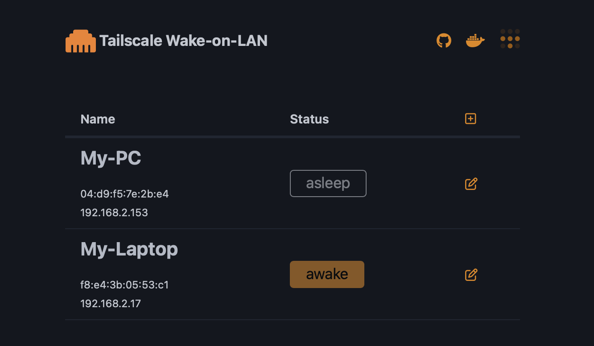

## Overview

This is a Docker container designed to be run on an amd64 or arm64 Linux host located inside your LAN network. It provides a simple web UI over Tailscale, allowing both local and remote tailnet devices to send wake-on-LAN packets to sleeping devices on your LAN.

## Tailscale prep

* Login to your Tailscale account and load the Admin Console.
* **Important:** Ensure HTTPS certificates have been enabled in Tailscale under the DNS tab. This will allow your wakeonlan container to automatically obtain and manage an HTTPS cert via LetsEncrypt.
* Install and connect to Tailscale on any other devices wishing to access the container. MagicDNS must be enabled to resolve the container's hostname, because it's not possible to access a TLS website by IP address alone.

In the Admin Console go to Settings -> Keys and create a new auth key. Name it wakeonlan and leave the other settings at their defaults. Copy the new key, it won't be shown again. Use this key as the value for TAILSCALE_AUTHKEY when starting the container.

## Docker host machine prep

A Linux sysctl setting needs to be changed on your Docker host machine to allow wake-on-LAN broadcast packets to pass from the docker0 internal container network out to the LAN interface. The following commands enable broadcast forwarding and make sure the change survives a reboot.

    sudo sysctl -w net.ipv4.conf.all.bc_forwarding=1
    echo 'net.ipv4.conf.all.bc_forwarding=1' | sudo tee -a /etc/sysctl.d/90-docker-wakeonlan.conf

    sudo sysctl -w net.ipv4.conf.docker0.bc_forwarding=1
    echo 'net.ipv4.conf.docker0.bc_forwarding=1' | sudo tee -a /etc/sysctl.d/90-docker-wakeonlan.conf

While the container does run in both Docker for Windows (I tested with WSL2 mode and Debian) and Docker for macOS, I am not sure there is an equivalent to the `bc_forwarding` sysctl to allow broadcast packets to leave the internal Docker network on non-Linux systems.

## Usage

You can run this container using either docker-compose or docker run.

### docker run (recommended)

```bash
docker run -d \
  --name tailscale-wakeonlan \
  -e TAILSCALE_HOSTNAME=wakeonlan \
  -e TAILSCALE_AUTHKEY=your-tskey \
  -e WOL_NETWORK=192.168.1.0/24 `#optional` \
  -v tailscale-wakeonlan-state:/var/lib/tailscale \
  --restart unless-stopped \
  --network bridge \
  ghcr.io/andygrundman/tailscale-wakeonlan:latest
```

### docker compose

```yaml
---
services:
  tailscale-wakeonlan:
    image: ghcr.io/andygrundman/tailscale-wakeonlan:latest
    hostname: wakeonlan
    container_name: tailscale-wakeonlan
    environment:
      - TAILSCALE_HOSTNAME=wakeonlan
      - TAILSCALE_AUTHKEY=your-tskey
      - WOL_NETWORK=192.168.1.0/24  # optional
    restart: unless-stopped
    volumes:
      - tailscale-wakeonlan-state:/var/lib/tailscale
networks:
  bridge:
    driver: bridge
volumes:
  tailscale-wakeonlan-state: # not a typo
```

## Parameters

The following parameters can be configured within the Docker Compose environment section or as docker run -e arguments.

| Parameter | Function |
| :----: | --- |
| `TAILSCALE_AUTHKEY` | Required. Create a new key from the Tailscale Settings -> Keys page for this variable. By default this key will be valid for 6 months, but you are able to set it to never expire by going to: Machines -> wakeonlan -> Machine settings -> Disable key expiry. |
| `TAILSCALE_HOSTNAME=wakeonlan` | Required. This value will be used as the Tailscale machine name, and the first part of the fully-qualified domain name when accessing the web interface. Default: `wakeonlan` |
| `TAILSCALE_USE_SSH=1` | This container can also provide a secure way to ssh into your network via the `tailscale ssh` command. For more details, read [the docs](https://tailscale.com/kb/1193/tailscale-ssh). Default: `0` |
| `WOL_NETWORK=192.168.1.0/24` | If your LAN subnet is not auto-detected correctly, you can specify it with this variable. The CIDR is used to choose the correct broadcast address to send wake-on-LAN packets to. |

## First time launch

When your container has booted up, access it from any other host on your tailnet. https://wakeonlan may work, or you can use the fully-qualified name as displayed in the console.

The first time you connect over HTTPS it will appear to hang for a few seconds while it requests and installs a LetsEncrypt SSL certificate. When the wake-on-LAN web UI appears, you can verify the site has been secured by a valid certificate by clicking on the lock icon. This certificate will be managed and renewed automatically by [Tailscale serve](https://tailscale.com/kb/1242/tailscale-serve).

## Web UI



Use the + icon to add any hosts that you want to be able to wake up. Name, MAC, and IP address fields are required. Although an IP address is not used to wake a system, the web UI uses the IP to perform a ping check.

To send a wake-on-LAN packet to a host, click the "asleep" (or "awake") button. After a packet is sent, several pings will be sent to let you know whether the system woke up or not.

TO make changes or delete a host, click the Edit (pencil) icon.

## /wake endpoint

The following URL scheme can be used to wake a MAC address via a broadcast packet sent to all devices on the LAN. It does not need to already be in the list of hosts, but will need to be on the same WOL_NETWORK network.

https://tailscale-wakeonlan/wake?mac=04:d9:f5:7e:2b:e4

## Architecture
```
                                        │
                 Home Network           │         Internet
           ┌─────────────────────┐      │
           │  Linux Server       │      │
           │                     │      │
           │ tailscale-wakeonlan │      │
           │   Docker container  │  https://wakeonlan.tailxxxx.ts.net
           │                     │ ◄────┬─────────────┐
           └─────┬───────────────┘      │             │
                 │                      │             │
                 ▼                      |             |
     Magic packet with MAC address      │             │
     to 192.168.1.255 broadcast         │           ┌─┴─┐
    ┌───────┬────────┬───────┐          │           │   │
    │       │        │       │          │           │   │
    ▼       ▼        ▼       ▼          │           └───┘
┌─────┐ ┌─────┐  ┌─────┐ ┌─────┐        │     Phone connected to
│     │ │     │  │     │ │     │        │         Tailscale
│     │ │     │  │ :)  │ │     │        │
│     │ │     │  │     │ │     │        │
└─────┘ └─────┘  └─────┘ └─────┘        │
                                        │
          LAN Computers                 │
```

## Non-Linux hosts

While the container does install and run within Docker on Windows (I tested with WSL2 mode and Debian), I couldn't figure out the equivalent to the `bc_forwarding` sysctl to allow broadcast packets to leave the internal Docker network.

It has not been tested on other host systems.

## Thanks

These were very helpful in determining the best way to build this container.

* https://tailscale.dev/blog/docker-mod-tailscale
* https://github.com/tailscale-dev/docker-mod
* https://www.devwithimagination.com/2020/06/15/homebridge-docker-and-wake-on-lan/
